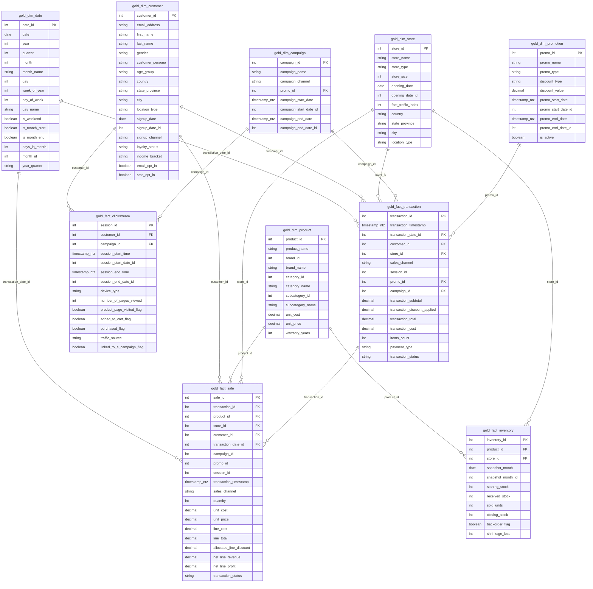

# Elecmart Retail Analytics — Databricks lakehouse

A medallion lakehouse for the Elecmart retail dataset on **Databricks Free Edition**, with an
**AI/BI dashboard** on top.

```
14 Parquet files
  └─ UC Volume  elecmart.bronze.landing
       └─ 01_bronze      → elecmart.bronze.*   (read_files → Delta)
            └─ 02_silver      → elecmart.silver.*   (clean / type / de-duplicate)
                 └─ 03_gold_star   → elecmart.gold.gold_*   (conformed star schema)
                      └─ 04_gold_bi_marts → elecmart.gold.bi_*   (metric views)
                           └─ AI/BI dashboard  +  Genie
                 └─ 05_data_quality   (assertions — fails the job on any violation)
```

---

## 1. Will this fit on a free Databricks account?

**Yes — comfortably.** Use **Databricks Free Edition** (`databricks.com/learn/free-edition`) —
**not** Community Edition, which has no SQL warehouse and cannot build dashboards.

The 14 Parquet files are in the repo working directory (`*.parquet`, ~420 MB total):

| file | rows | size |
|---|--:|--:|
| `fact_clickstream.parquet` | 14,500,000 | 351 MB |
| `fact_sale.parquet` | 1,799,836 | 34 MB |
| `fact_transaction.parquet` | 900,000 | 26 MB |
| `inventory.parquet` | 846,000 | 5 MB |
| `dim_customer.parquet` | 150,000 | 5 MB |
| 9 other dims | < 10k each | < 1 MB |

| Free Edition | This project needs |
|---|---|
| Serverless compute, per-account usage quota | Full build ≈ a few minutes; dashboard refresh is seconds |
| 1 SQL warehouse, `2X-Small` | Enough for `bi_*` views over ~18 M rows |
| Unity Catalog, Volumes, Workflows, AI/BI, Genie | all used here |
| 5 concurrent job tasks, 1 pipeline per type | pipeline is 6 sequential tasks |

`03_gold_star` keeps `gold_fact_clickstream` as a **view** (not a copy) so the 14.5 M-row table is
stored only once. Everything else is a Delta table.

If your workspace blocks `CREATE CATALOG`: find-and-replace `elecmart.` → `workspace.` in the 6
notebooks and drop the `CREATE CATALOG` line in `00_setup.sql`.

---

## 2. Connecting from this machine

Nothing is configured locally — no `databricks` CLI, no `~/.databrickscfg`, no `DATABRICKS_*`
env vars — so the notebooks can't be pushed from here yet. Two options:

**A. Manual UI import** (section 3) — no local setup.

**B. CLI / Asset Bundle:**

```bash
# install the CLI
curl -fsSL https://raw.githubusercontent.com/databricks/setup-cli/main/install.sh | sh

# authenticate with a Personal Access Token
#   workspace ▸ User settings ▸ Developer ▸ Access tokens ▸ Generate new token
databricks configure --token          # Host: https://<workspace>.cloud.databricks.com
databricks current-user me            # verify

# deploy notebooks + dashboard + serverless job
cd databricks/workflow
databricks bundle deploy -t dev
databricks bundle run elecmart_pipeline -t dev
```

---

## 3. Run it (manual UI path — Free Edition)

1. **Sign in** to Free Edition.
2. **Import notebooks**: Workspace ▸ *Import* ▸ upload the 6 files in `notebooks/` (import as SQL notebooks).
3. **`00_setup`** → *Run all* (serverless). Creates catalog `elecmart`, schemas, volume
   `elecmart.bronze.landing`.
4. **Upload data**: Catalog ▸ `elecmart` ▸ `bronze` ▸ `landing` ▸ *Upload to volume* ▸ drag in all
   **14 `.parquet` files** (flat, no sub-folders). `fact_clickstream.parquet` is 351 MB — under the
   2 GB per-file UI limit.
5. Run **`01_bronze` → `02_silver` → `03_gold_star` → `04_gold_bi_marts` → `05_data_quality`** in order.
6. **Dashboard**: Dashboards ▸ *Create* ▸ ⋯ ▸ *Import dashboard* ▸
   `dashboards/elecmart_retail_analytics.lvdash.json`. Pick the SQL warehouse, *Publish*.
7. **Genie** (optional): New ▸ *Genie space* ▸ add tables `elecmart.gold.gold_*` ▸ ask
   "net revenue by month", "top 10 products by profit", "conversion rate by device".

To schedule: the bundle in `workflow/databricks.yml` wraps steps 3 + 5 in a 6-task serverless job.

---

## 4. Files

| Path | Purpose |
|---|---|
| `notebooks/00_setup.sql` | catalog, schemas, landing volume |
| `notebooks/01_bronze.sql` | `read_files()` → 14 bronze Delta tables |
| `notebooks/02_silver.sql` | clean / type / de-duplicate + light enrichment |
| `notebooks/03_gold_star.sql` | 6 dimensions + 4 facts + informational PK/FK for Genie |
| `notebooks/04_gold_bi_marts.sql` | `bi_*` metric views the dashboard reads |
| `notebooks/05_data_quality.sql` | 20 assertions; `raise_error` fails the job on any violation |
| `dashboards/elecmart_retail_analytics.lvdash.json` | 2-page AI/BI dashboard (Overview + Deep dive) with a date-range filter |
| `dbt/` | optional dbt path — see `dbt/README.md` |
| `workflow/databricks.yml` | Asset Bundle: notebooks + dashboard + serverless job |

---

## 5. Databricks SQL notes

- **Bronze load** — `read_files('/Volumes/…/x.parquet', format => 'parquet')` into
  `CREATE OR REPLACE TABLE`. Point at a folder or glob instead if a source is split into part-files.
- **Constraints** — Unity Catalog PK/FK are informational (not enforced); PK columns must be
  `NOT NULL`. They drive join discovery in Genie and AI/BI.
- **Functions** — `date_diff(YEAR, birth_date, current_date())` for age;
  `cast(date_format(d,'yyyyMM') as int)` for a month key; `` day(last_day(`date`)) `` (back-tick the
  `date` column). `initcap`, `lower`, `trim`, `row_number() OVER`, `||`, `coalesce`, `nullif`,
  `round` behave as expected.
- **`gold_fact_clickstream`** is a view to avoid a second copy of 14.5 M rows on Free Edition.

---

## 6. What's on the dashboard

Two pages, reads only `elecmart.gold.bi_*`. A **date-range filter** on the Overview page
cross-filters every time-series dataset.

**Page 1 — Overview**
- **KPI counters** — Net Revenue, Gross Profit, Gross Margin %, Completed Orders, Units Sold, AOV
- Net revenue by month (line) · Revenue by category (bar)
- Revenue by channel · Top 15 products · Revenue by loyalty tier (bars)
- Session conversion rate by month (line) · Sessions by device (bar)
- Store performance (table)
- Campaign attributed revenue (bar) · Inventory turnover by category (bar)

**Page 2 — Deep dive**
- Conversion funnel (all sessions) · Revenue by day of week
- Top 15 brands · Top 15 sub-categories
- Revenue by payment type · Returned revenue by category · Top 15 promotions
- New vs returning customers by month (table)
- Revenue by region (table) · Inventory health by store (table)

If the import rejects a widget, only that widget falls back to default — the datasets and other
widgets still load. The date-range filter (`widget.name = "f_date"`) is the most spec-sensitive; if
it complains, delete that one layout object and re-add it via *Add ▸ Filter ▸ Date range* on
`month_start` / `sale_date`, bound to "All datasets". Same for extra filters (category, channel,
store). Genie can also answer straight off the `bi_*` views with no dashboard at all.

---

## 7. Gold data model

### Star schema (`elecmart.gold.gold_*`)



`gold_fact_clickstream` is a view (no enforced keys); `PK`/`FK` on it are logical only.
`gold_fact_sale` carries `store_id` / `customer_id` / `sales_channel` / `campaign_id` / `promo_id`
denormalised from its parent transaction so line-level slicing needs no extra join.

### BI marts (`elecmart.gold.bi_*` — views)

| view | grain | key columns |
|---|---|---|
| `bi_kpi_summary` | 1 row | net_revenue, gross_revenue, gross_profit, gross_margin_pct, total_transactions, returned_transactions, total_orders, units_sold, aov, return_rate_pct |
| `bi_revenue_by_month` | month | month_start, net_revenue, gross_profit, gross_margin_pct, orders, units_sold |
| `bi_daily_sales` | day | sale_date, net_revenue, gross_profit, orders, units_sold, aov |
| `bi_sales_by_category` | category | category_name, net_revenue, gross_profit, units_sold |
| `bi_sales_by_subcategory` | sub-category | category_name, subcategory_name, net_revenue, gross_profit, units_sold |
| `bi_sales_by_brand` | brand | brand_name, net_revenue, gross_profit, units_sold |
| `bi_sales_by_channel` | channel | sales_channel, net_revenue, orders, aov |
| `bi_sales_by_payment_type` | payment type | payment_type, orders, net_revenue, aov |
| `bi_sales_by_region` | store city | country, state_province, city, net_revenue, orders |
| `bi_sales_by_weekday` | weekday | day_of_week, day_name, net_revenue, orders, aov |
| `bi_top_products` | product | product_name, category_name, brand_name, net_revenue, units_sold |
| `bi_sales_by_store` | store | store_id, store_name, city, state_province, store_type, net_revenue, gross_profit, gross_margin_pct, orders, aov |
| `bi_returns_by_category` | category | category_name, returned_revenue, returned_orders, return_rate_pct |
| `bi_customer_summary` | customer | customer_id, loyalty_status, income_bracket, age_group, customer_persona, signup_channel, country, state_province, city, orders, lifetime_revenue, first_order_ts, last_order_ts, days_since_last_order, is_repeat_customer |
| `bi_customer_loyalty_mix` | loyalty tier | loyalty_status, active_customers, repeat_customers, repeat_rate_pct, net_revenue, avg_revenue_per_customer, avg_orders_per_customer |
| `bi_customer_new_vs_returning_by_month` | month | month_start, new_customers, returning_customers, new_customer_revenue, returning_customer_revenue |
| `bi_clickstream_funnel_by_month` | month | month_start, sessions, product_view_sessions, add_to_cart_sessions, purchase_sessions, conversion_rate_pct, add_to_cart_rate_pct, bounce_rate_pct, cart_abandonment_pct |
| `bi_funnel_overall` | 4 stage rows | step, stage, sessions, pct_of_sessions |
| `bi_sessions_by_device` | device | device_type, sessions, purchase_sessions, conversion_rate_pct |
| `bi_sessions_by_traffic_source` | traffic source | traffic_source, sessions, purchase_sessions, conversion_rate_pct |
| `bi_campaign_performance` | campaign | campaign_id, campaign_name, campaign_channel, sessions, attributed_orders, attributed_revenue, conversion_rate_pct |
| `bi_promotion_performance` | promotion | promo_id, promo_name, promo_type, discount_type, promo_orders, promo_revenue, discount_given, avg_revenue_per_promo_txn |
| `bi_inventory_by_category` | category | category_name, inventory_turnover, total_units_sold, total_units_received, total_shrinkage_loss, backorder_rate_pct |
| `bi_inventory_by_month` | month | snapshot_month, inventory_turnover, sold_units, received_stock, shrinkage_loss, backorder_rate_pct |
| `bi_inventory_by_store` | store | store_name, city, state_province, inventory_turnover, total_units_sold, total_shrinkage_loss, backorder_rate_pct |

All revenue/profit columns are **completed transactions only** (`transaction_status = 'Completed'`);
`bi_kpi_summary.gross_revenue`, `return_rate_pct` and `bi_returns_by_category` include returns.

---

## 8. Extending it

Free Edition has **no limit** on the number of tables, views, dashboards or pages — only serverless
compute is metered. To add more:

- **More gold marts** — add `CREATE OR REPLACE VIEW elecmart.gold.bi_<name> AS …` to
  `04_gold_bi_marts.sql` and a line to its smoke test. Keep the "completed only" convention.
- **More dashboard pages/widgets** — add a dataset (`SELECT * FROM elecmart.gold.bi_<name>`) and
  drag visuals onto a new page, or regenerate the JSON.
- **Genie** — every `bi_*` view is already a clean, single-grain table Genie can answer from.
